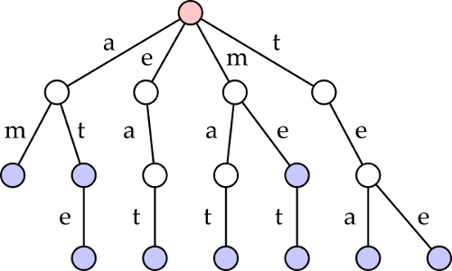

# Module 9 Homework - Trees

## Prefix Trees
A prefix tree, or a trie (from re-TRIE-ve), is a tree intended for storing a set of keys, often strings. The data structure is optimized for fast retrieval of the keys and for space.

The nodes in a prefix tree do not store full keys directly. Instead, nodes store part of a key, with a node's position defining the key it represents.

We are going to implement a prefix tree dedicated to strings, where the keys are going to be valid words. Each node will store one character of a key.

For instance, the valid keys
```python
['am', 'at', 'ate', 'eat', 'mat', 'me', 'met', 'tea', 'tee']
   ```
are represented by the blue nodes in the following prefix tree



Note that the root node (in red) represents an empty string. 

## Assignment
We have implemented the prefix tree through a class `WordTrie`, using a node class `TrieNode` for the recursive structure. `WordTrie` is complete, you must implement the recursive functionality in `TrieNode`.

Two important assumptions will arise as you complete this assignment:
* assume that the words contain only lowercase letters a-z
* assume that the words are given in *alphabetical* order, as a list of strings. The alphabetical ordering is relevant, as Python dictionaries maintain insertion order.


## `WordTrie` functionality (implemented for you)
* The `WordTrie` should be initialized using an alphabetically ordered list of strings
   ```python
    >>> my_words = ['am', 'at', 'ate', 'eat', 'mat', 'me', 'met', 'tea', 'tee']
    >>> my_trie = WordTrie(my_words)
   ```

* `get_words` returns a generator of all words with a given prefix
   ```python
    >>> for word in my_trie.get_words('t'): print(word)
    tea
    tee
   ```

* The `iter` operator provides an iterator over all valid words
   ```python
    >>> for word in my_trie: print(word, end=' ')
    am at ate eat mat me met tea tee
   ```

* `get_nb_words` returns the number of words with a given prefix
   ```python
    >>> my_trie.get_nb_words('m')
    3
    >>> my_trie.get_nb_words('at')
    2
    >>> my_trie.get_nb_words('mt')
    0
   ```

* `len` returns the number of valid words in the trie
   ```python
    >>> len(my_trie)
    9
   ```

* The `in` operator works as expected
   ```python
    >>> 'eat' in my_trie
    True
    >>> 'ma' in my_trie    # 'ma' is a node but not a valid word
    False
   ```

The above methods are fundamentally just a wrapper - the difficult recursive functionality, which you are responsible for implementing, is in the `TrieNode` class.


## `TrieNode`
### Attributes added during `init`
Each node adds only the following two attributes during `init` (the methods described below are also attributes stored in each node object, but methods are not added to an object during `init`).
* `_children` - a dictionary of children. Keys are letters, values are the nodes associated with those letters.
   For instance, the root node in the figure shown above would have a dictionary with 4 items:
   ```python
   _root._children = {'a':some_node,
                      'e':some_node,
                      'm':some_node,
                      't':some_node}
   ```

* `_is_word` - a Boolean describing whether the current node marks the end of a valid word

No other information is stored in the nodes. This includes:
   *  The prefix of the node
   *  The number of nodes in the subtree

## Deliverables
Implement the following functions in the `TrieNode` class. You are free to add additional input paremeters and methods as you see fit, but do not change the attributes defined in a node's `init`.

* `init` - initializes a new node. The only attributes you should add here are `_children` and `_is_word`, but feel free to adjust the list of input paramaters

* `add_word(self, word)` - adds a word (a string with one or more characters) to the Trie. Only used during initialization.

* `find_node(self, prefix)` - returns the node representing a given prefix (a string with zero or more characters)

* `get_words(self, prefix)` - returns a generator, which generates all the words with the given prefix (a string with zero or more characters) in the subtrie rooted at this node

* `get_nb_words(self)` - returns the number of words (with any prefix) in the subtrie rooted at this node
### Note on Generators
A generator function uses the keyword `yield` rather than `return`. 

In recursive generator functions, we use `yield from` for recursive calls and `yield` to return the base case. For instance, the `in_order` function from lab:
```python
    def in_order(self):
        if self.left is not None:
            yield from self.left.in_order()   # recursively go left
        
         yield self.key        # return this key
        
         if self.right is not None:
            yield from self.right.in_order() # recursively go right
```


## Submission
At a minimum, submit the following file:
* `WordTrie.py`

Students must submit to Mimir **individually** by the due date (typically, the second Wednesday after this module opens at 11:59 pm EST) to receive credit.

## Grading
We test the public interface in Mimir - the class `WordTrie`.

You will find this assignment easier if you take some time to write test cases for the class `TrieNode.` 

* 10 - `init`
   * 5 - recursive implementation
   * 5 - correctness of the implementation
* 20 - `get_words`
   * 5 - implemented as a generator function
   * 15 - functionality
* 20 - `get_nb_words`
   * 5 - recursive
   * 15 - functionality
* 15 - `len`
   * 15 - functionality
* 15 - `in`
   * 15 - functionality
* 20 - `iterator`
   * 5 - implemented as a generator function
   * 15 - functionality

In order to ensure a correct implementation, all the hidden test cases enforce the rules given for the attributes in the `TrieNode` class.

## Feedback
If you have any feedback on this assignment, please leave it [here](https://s.uconn.edu/cse2050_feedback).

We check this feedback regularly. It has resulted in:
* A simplified, clear **Submitting** section on all assignments
* A simplified, clear **Grading** section on all assignments
* Clearer instructions on several assignments